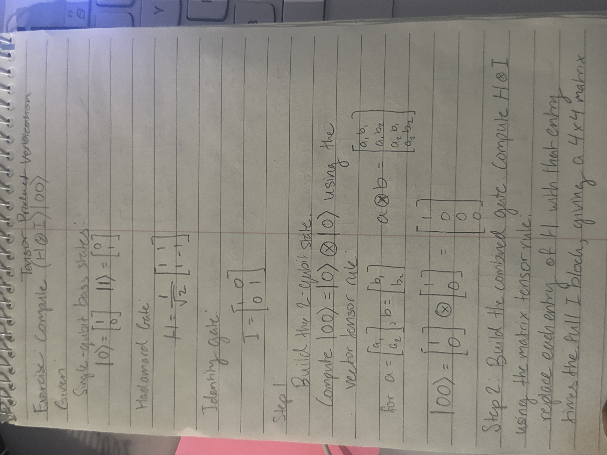
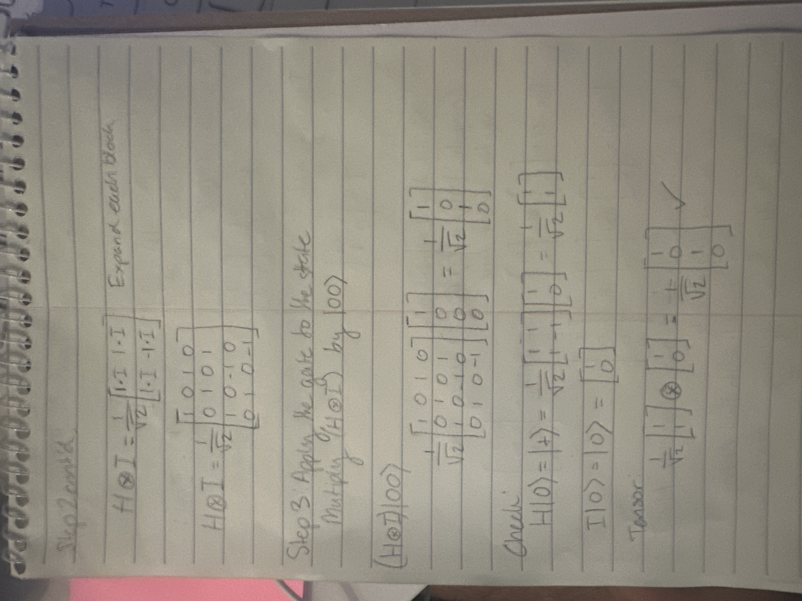

# zero-to-qml

This repo documents building quantum machine learning understanding from raw linear algebra up through Cirq and a manual hybrid QML training loop.

Commits track progress session by session — this is not a single final deliverable, it's a learning journal.

## Setup

```bash
python -m venv venv
source venv/bin/activate   # Linux/macOS
venv\Scripts\activate      # Windows

pip install numpy
```

## Tensor products & basic gate math

Paper derivation of (H⊗I)|00⟩, cross-checked against the NumPy verification in [tensor-products/tensor_product_verification.py](tensor-products/tensor_product_verification.py).

<p align="center">
  
  
</p>
